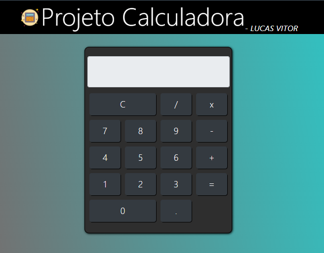
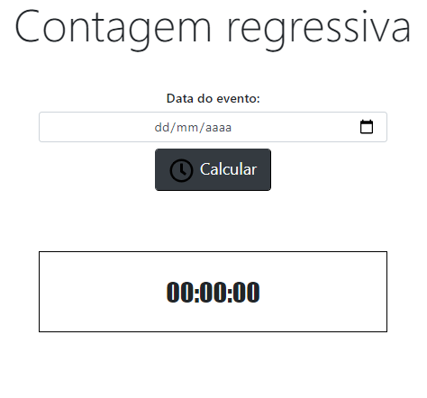
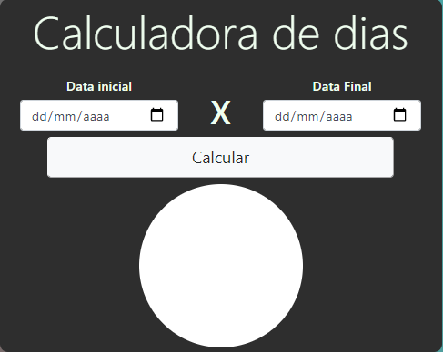

# CALCULADORAS-JAVASCRIPT
Uso de funções matemáticas no JAVASCRIPT.

Esse web-site foi desenvolvido a partir do uso do **BOOTSTRAP** como ferramenta de estilização e de criação de um layout responsivo e adpativo que se dispõe adequadamente em qualquer tipo de tela, através do uso de
"col" e "row" com especificações de tela como exemplo: "md-7 sm-2 lg-8 xl-6" dando para cada dimensão de tela, uma X dimensão de tela.

A função desse website foi treinar minhas habilidades com javascript criando não só uma calculadora, mas também, calculadora de dias e tempo também.
Para isso utilizei métodos como:

-  new Date /getTime()/getDate(), para manipular operações com datas.
-  eval, para manipulas as operações descritas dentro do input da calculadora.

Criado por, Lucas Vitor.

## ENGLISH - Use of mathematical functions in JAVASCRIPT.

This web-site was developed using **BOOTSTRAP** as a styling tool and the creation of a responsive and adaptive layout that is properly available on any type of screen, through the use of
**"col"** and **"row"** with screen specifications as an example: "md-7 sm-2 lg-8 xl-6" giving each screen dimension an X screen dimension.

The function of this website was to train my javascript skills by creating not only a calculator, but also a days and time calculator as well.
For that I used methods like:

- new Date / getTime () / getDate (), to handle date operations.
- eval, to manipulate the operations described inside the calculator's input.

Created by, Lucas Vitor.

Gallery - Galeria

  
